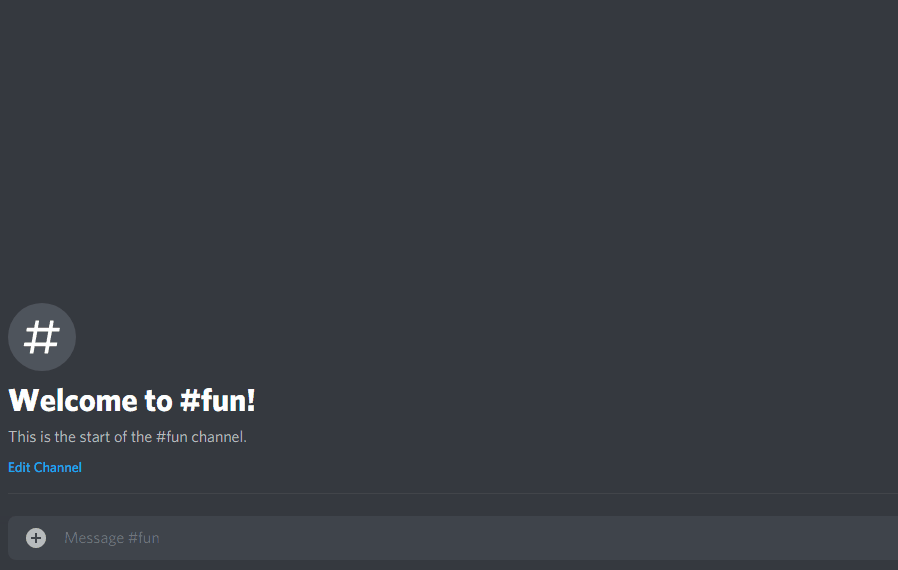

# FridayThen Discord Bot
> A discord bot that replies with a video that should only be played on fridays 😎

The FridayThen Discord bot has only one job...to post this awesome video only on fridays:
`https://www.youtube.com/watch?v=1AnG04qnLqI`

Only command to be used in discord is ```!friday``` which will nett you the following:





## Installation

### Clone

- Clone this repo to your local machine using `https://github.com/rpotter9/fridaythen-discord-bot`

### Setup

1. Create a bot first. You can find out how at `https://discordpy.readthedocs.io/en/latest/discord.html`.

2. Once created, add the bot to your discord server of choice

3. Copy your bot's secret token, we will need this later.

4. Navigate to fridaythen-discord-bot folder and run:

```shell
$ npm install
```

5. Create a .env file with the following inside:

```code
BOT_TOKEN=*YOUR BOT SECRET TOKEN*
```

6. Open up VS code terminal and execute the following:
```shell
$ node app.js
```

7. Now go to your discord server where the bot is installed, go to a text channel and type the following:
```text
!friday
```

Enjoy!